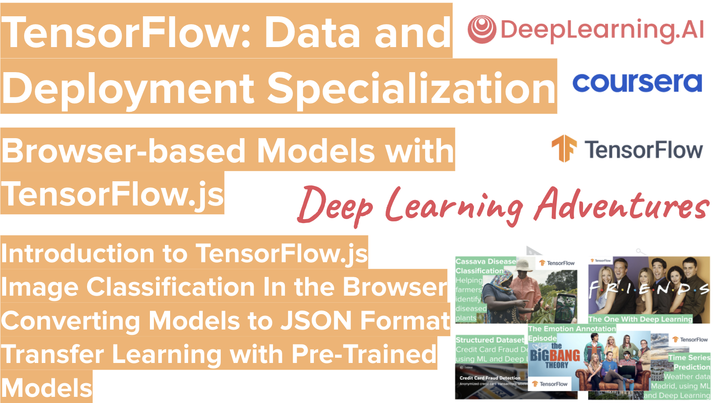

# TensorFlow-Data-and-Deployment
**TensorFlow: Data and Deployment** presented to you by the coolest AI community out there, **Deep Learning Adventures**: https://www.meetup.com/Deep-Learning-Adventures  

**Browser-based Models with TensorFlow.js**
In this first course, you’ll train and run machine learning models in any browser using TensorFlow.js. You’ll learn techniques for handling data in the browser, and at the end you’ll build a computer vision project that recognizes and classifies objects from a webcam.

