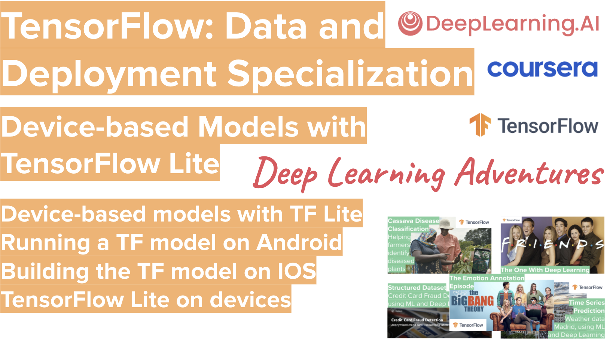

# TensorFlow-Data-and-Deployment
**TensorFlow: Data and Deployment** presented to you by the coolest AI community out there, **Deep Learning Adventures**: https://www.meetup.com/Deep-Learning-Adventures  

**Device-based Models with TensorFlow Lite**
This second course teaches you how to run your machine learning models in mobile applications. You’ll learn how to prepare models for a lower-powered, battery-operated devices, then execute models on both Android and iOS platforms. Finally, you’ll explore how to deploy on embedded systems using TensorFlow on Raspberry Pi and microcontrollers.

