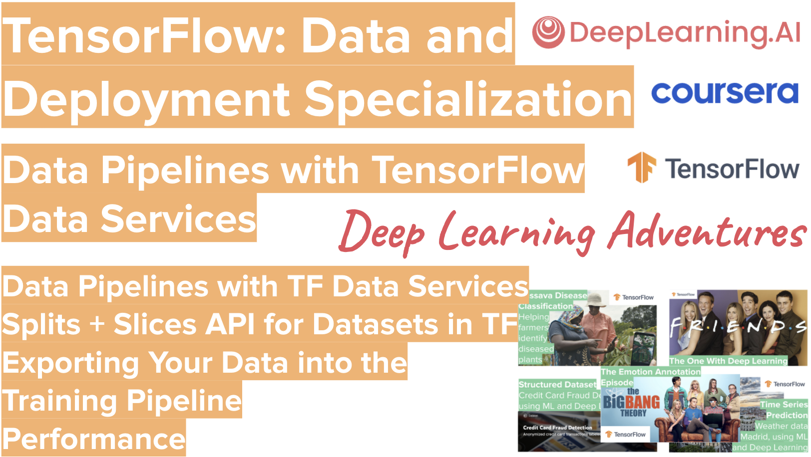

# TensorFlow-Data-and-Deployment
**TensorFlow: Data and Deployment** presented to you by the coolest AI community out there, **Deep Learning Adventures**: https://www.meetup.com/Deep-Learning-Adventures  

**Data Pipelines with TensorFlow Data Services**
In this third course, you will:
- Perform streamlined ETL tasks using TensorFlow Data Services
- Load different datasets and custom feature vectors using TensorFlow Hub and TensorFlow Data Services APIs
- Create and use pre-built pipelines for generating highly reproducible I/O pipelines for any dataset
- Optimize data pipelines that become a bottleneck in the training process
- Publish your own datasets to the TensorFlow Hub library and share standardized data with researchers and developers around the world

