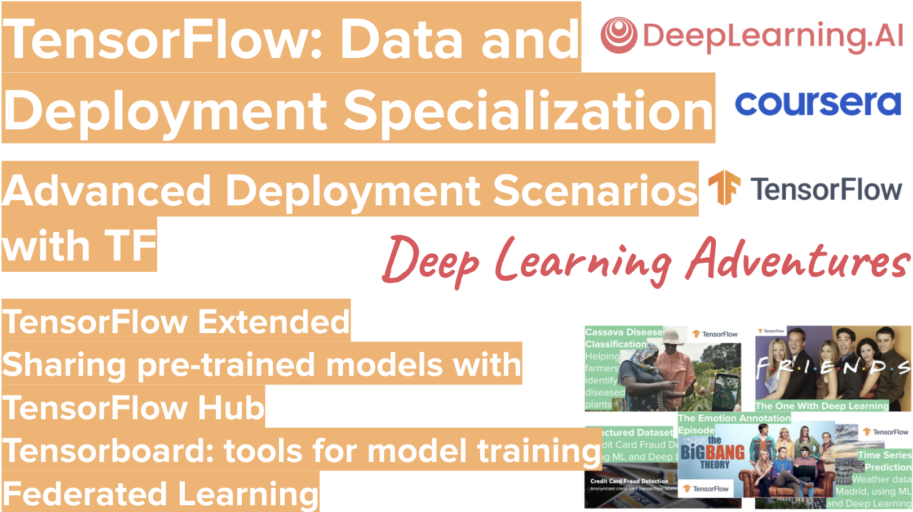

# TensorFlow-Data-and-Deployment
**TensorFlow: Data and Deployment** presented to you by the coolest AI community out there, **Deep Learning Adventures**: https://www.meetup.com/Deep-Learning-Adventures  

**Advanced Deployment Scenarios with TensorFlow**
In this final course, you’ll explore four different scenarios you’ll encounter when deploying models. You’ll be introduced to TensorFlow Serving, a technology that lets you do inference over the web. You’ll move on to TensorFlow Hub, a repository of models that you can use for transfer learning. Then you’ll use TensorBoard to evaluate and understand how your models work, as well as share your model metadata with others. Finally, you’ll explore federated learning and how you can retrain deployed models with user data while maintaining data privacy.

