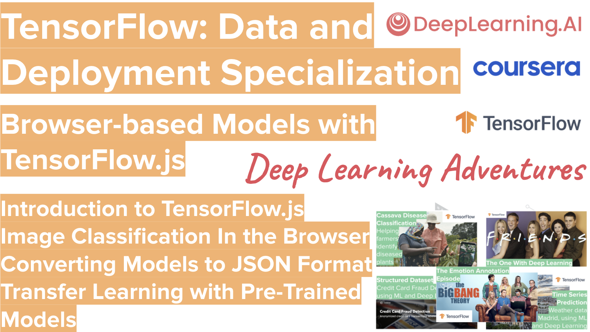

# TensorFlow-Data-and-Deployment
**TensorFlow: Data and Deployment** presented to you by the coolest AI community out there, **Deep Learning Adventures**: https://www.meetup.com/Deep-Learning-Adventures  

Join us for our 5th adventure on our journey to deep learning and data science in general 🎉 with the TensorFlow: Data and Deployment Specialization  

https://www.coursera.org/specializations/tensorflow-data-and-deployment  

Continue developing your skills in TensorFlow as you learn to navigate through a wide range of deployment scenarios and discover new ways to use data more effectively when training your machine learning models.

In this four-course Specialization, you’ll learn how to get your machine learning models into the hands of real people on all kinds of devices. Start by understanding how to train and run machine learning models in browsers and in mobile applications. Learn how to leverage built-in datasets with just a few lines of code, learn about data pipelines with TensorFlow data services, use APIs to control data splitting, process all types of unstructured data, and retrain deployed models with user data while maintaining data privacy. Apply your knowledge in various deployment scenarios and get introduced to TensorFlow Serving, TensorFlow, Hub, TensorBoard, and more.

Industries all around the world are adopting Artificial Intelligence. This Specialization from Laurence Moroney and Andrew Ng will help you develop and deploy machine learning models across any device or platform faster and more accurately than ever.

**Course 1 Week 1**  
Introduction to TensorFlow.js  

Welcome to Browser-based Models with TensorFlow.js, the first course of the TensorFlow for Data and Deployment Specialization. In this first course, we’re going to look at how to train machine learning models in the browser and how to use them to perform inference using JavaScript. This will allow you to use machine learning directly in the browser as well as on backend servers like Node.js. In the first week of the course, we are going to build some basic models using JavaScript and we'll execute them in simple web pages.

**Course 1 Week 2**  
Image Classification In the Browser  

This week we'll look at Computer Vision problems, including some of the unique considerations when using JavaScript, such as handling thousands of images for training. By the end of this module you will know how to build a site that lets you draw in the browser and recognizes your handwritten digits!

**Join us on Slack**:  
https://join.slack.com/t/deeplearninga-nmk8930/shared_invite/zt-pnzo1ltc-9_aP~mZCTC5sbUkaQ0QTOw

**Spread the word about our meetup** 🎉

**Deep Learning YouTube playlists**, feel free to share and subscribe 😀  
Our BRAND NEW **TF Data and Deployment YouTube playlist** is available at: http://bit.ly/dla-tf-data-deployment
